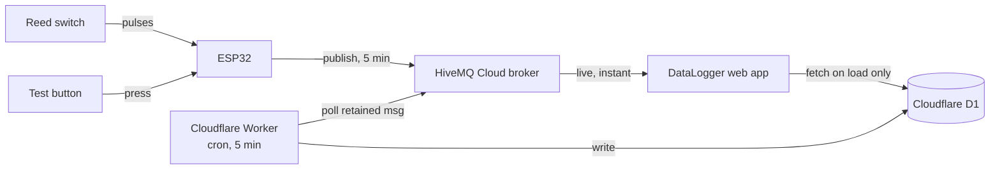

# DataLogger Water Meter System — Handover

## What this is

An ESP32 counts pulses from a reed switch on a water meter, publishes readings
to a cloud MQTT broker, and a phone-installable web app displays live usage.
A separate always-on Cloudflare job backfills any readings missed while the
app was closed. Everything runs on free tiers — no server to maintain, no
recurring cost.

## Architecture



## Components

| Component | Platform | Role |
|---|---|---|
| Firmware | ESP32 (Arduino) | Counts pulses, publishes readings |
| Broker | HiveMQ Cloud (free) | Routes messages, holds the latest retained value |
| Web app | GitHub Pages (PWA) | Live display, installed to home screen |
| History logger | Cloudflare Worker + D1 | Gapless backup, independent of the app |

## Intervals — the full picture

| What | How often | Trigger |
|---|---|---|
| Reed switch pulse counting | Continuous | Hardware interrupt, 50ms debounce |
| Button press → event message | Immediate | Hardware interrupt, 200ms debounce |
| ESP32 → MQTT reading publish | Every 5 minutes | Timer in firmware (`PUBLISH_INTERVAL_MS`) |
| ESP32 → flash (NVS) checkpoint | Every 10 pulses, or alongside every publish | Wear-leveling — avoids writing flash on every single pulse |
| Web app ↔ broker (live view) | Continuous connection | WebSocket stays open the whole time the app is open; updates the instant the ESP32 publishes |
| Web app → Cloudflare history fetch | Once | On app load, and once after saving settings — **not** a repeating poll |
| Cloudflare Worker → broker poll | Every 5 minutes | Cron trigger, independent of whether the app is open |
| D1 storage | Permanent | No automatic expiry (see Storage note below) |

The two "every 5 minutes" timers (ESP32 publishing, Cloudflare polling) run
independently and aren't synchronized — the Worker just grabs whatever the
broker's retained value is at whatever moment its own timer fires, which is
why the poll uses the *retained* flag rather than needing to be perfectly
in sync with the device's publish schedule.

## Data flow

**Reading (every 5 min)** — topic `home/water/watermeter-01/data`, retained:
```json
{"device":"watermeter-01","seq":42,"ts":1200,"interval_pulses":6,"total_pulses":8391}
```

**Button event (on press)** — topic `home/water/watermeter-01/event`, not retained:
```json
{"device":"watermeter-01","event":"button_pressed","ts":1200,"total_pulses":8391}
```

**Status (on connect/disconnect)** — topic `home/water/watermeter-01/status`, retained:
```
"online"  /  "offline" (last-will, fires automatically on unclean disconnect)
```

The web app converts `interval_pulses` and `total_pulses` to liters using a
locally-stored K-factor (liters per pulse) — the broker and Cloudflare never
see liters, only raw pulse counts.

## Configuration reference

| Setting | Value |
|---|---|
| MQTT host | `YOUR_CLUSTER.s1.eu.hivemq.cloud` |
| MQTT port (device) | `8883` (TLS) |
| MQTT port (browser) | `8884` (WebSocket + TLS) |
| MQTT username | your HiveMQ credential |
| K-factor | `0.5` L/pulse (calibrated against a measured volume) |
| Reed switch pin | GPIO 27 → GND |
| Button pin | GPIO 14 → GND |

> **The real values are not in this repo.** This is a public repository, so
> the cluster URL, username and password are placeholders. The live values
> live in `SECRETS.local.md`, which is gitignored and stays on the dev
> machine only.

## Storage note

At one reading every 5 minutes, D1 accumulates roughly 10 MB/year — nowhere
close to the free tier's 500 MB per-database limit (see prior discussion;
this would take several decades to become relevant). No pruning needed for
the foreseeable future.

## Known trade-offs (by design, not oversights)

- **Broker credentials live in the web app's client-side code.** Acceptable
  for a single-user hobby project; would need a backend proxy for anything
  multi-user or public-facing.
- **TLS certificate validation is skipped** (`setInsecure()` / equivalent) on
  both the firmware and the Cloudflare Worker. Traffic is still encrypted,
  just not pinned to HiveMQ's specific certificate.
- **The web app's live view depends on the app being open.** The Cloudflare
  logger exists specifically to cover the gap when it isn't.

## If something needs changing later

- **Different publish frequency:** `PUBLISH_INTERVAL_MS` in the firmware,
  reflash.
- **Different K-factor:** app's Set up screen only — no firmware or
  Cloudflare changes needed.
- **New broker credentials:** update in three places — firmware, app Set up
  screen, and the Cloudflare Worker's Settings → Variables and Secrets.
- **Test without the real sensor:** flip `TEST_MODE` to `true` in the
  firmware (currently `false`) — generates fake pulses every ~20s.
