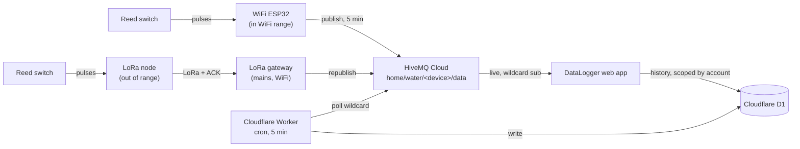

# DataLogger Water Meter System — Handover

## What this is

A meter-side board counts pulses from a reed switch on a water meter and
publishes readings to a cloud MQTT broker; a phone-installable web app shows
live usage; an always-on Cloudflare job logs every reading so history survives
the app being closed. Everything runs on free tiers — no server, no recurring
cost.

Several meters across more than one household share one broker, Worker and
database. An "account" is a row in D1 owning a list of meters, reached with a
username and password — there is no API key.

There are two meter-side options, interchangeable downstream:

- **WiFi ESP32** — publishes to MQTT directly. Used where the meter is in WiFi
  range.
- **LoRa node + gateway pair** — the node has no WiFi at all; it transmits over
  LoRa to a mains-powered gateway which republishes to the identical MQTT
  topic. Used where the meter is out of WiFi range. Solves *range*, not battery
  life.

## Architecture



## Components

| Component | Platform | Role |
|---|---|---|
| WiFi firmware | ESP32 (Arduino) | Counts pulses, publishes to MQTT directly |
| LoRa node firmware | Heltec WiFi LoRa 32 V3.2 | Counts pulses, transmits over LoRa. No WiFi/MQTT |
| LoRa gateway firmware | Heltec WiFi LoRa 32 V3.2 | Receives LoRa, republishes to the same MQTT topics |
| Broker | HiveMQ Cloud (free) | Routes messages, holds the latest retained value per meter |
| Web app | GitHub Pages (PWA) | Live display + history, meter switcher, installed to home screen |
| History logger | Cloudflare Worker + D1 | Gapless backup and per-account scoping, independent of the app |

## Meters and accounts

| Device id | Owner | Hardware | Gateway |
|---|---|---|---|
| `R-H1` | Ryan | WiFi ESP32 | — |
| `K-H1` | Kev (home) | LoRa pair | `K-H1-gw` |
| `K-Fact1` | Kev (factory) | LoRa pair | `K-Fact1-gw` |
| `K-Fact2` | Kev (factory) | LoRa pair | `K-Fact2-gw` |

`DEVICE_ID` is the primary key of the whole system: it names the topics, it's
what D1's `UNIQUE(device, seq)` keys on, and it's what an account is granted
against. Case-sensitive throughout. Two boards sharing one id corrupt each
other's data silently.

Logins live in D1 — usernames in the clear, passwords as PBKDF2 hashes. There
is nothing to keep in `SECRETS.local.md` for them, and nothing that could be
committed to this repo by accident.

## Intervals — the full picture

| What | How often | Trigger |
|---|---|---|
| Reed switch pulse counting | Continuous | Hardware interrupt, 50ms debounce |
| Button press → event message | Immediate | Hardware interrupt, 200ms debounce |
| ESP32 → MQTT reading publish | Every 5 minutes | Timer in firmware (`PUBLISH_INTERVAL_MS`) |
| ESP32 → flash (NVS) checkpoint | Every 10 pulses, or alongside every publish | Wear-leveling — avoids writing flash on every single pulse |
| Web app ↔ broker (live view) | Continuous connection | WebSocket stays open the whole time the app is open; updates the instant the ESP32 publishes |
| Web app → Cloudflare history fetch | Once | On app load, and once after saving settings — **not** a repeating poll |
| Cloudflare Worker → broker poll | Every 5 minutes | Cron trigger, independent of whether the app is open |
| D1 storage | Permanent | No automatic expiry (see Storage note below) |

The two "every 5 minutes" timers (ESP32 publishing, Cloudflare polling) run
independently and aren't synchronized — the Worker just grabs whatever the
broker's retained value is at whatever moment its own timer fires, which is
why the poll uses the *retained* flag rather than needing to be perfectly
in sync with the device's publish schedule.

## Data flow

**Reading (every 5 min)** — topic `home/water/<device-id>/data`, retained:
```json
{"device":"K-H1","seq":42,"ts":1200,"interval_pulses":6,"total_pulses":8391}
```

The LoRa node adds `"vbat"` (volts, 2dp) to both message types when a cell is
actually present — it's omitted below ~2.5 V, which means USB-only with no
battery on the rail. The WiFi ESP32 never sends it, having no cell to report.
Everything downstream ignores fields it doesn't recognise, so the field is
safe to be present or absent on any given message; the web app just shows the
battery when it's there.

**Button event (on press)** — topic `home/water/<device-id>/event`, not retained:
```json
{"device":"K-H1","event":"button_pressed","ts":1200,"total_pulses":8391}
```

Nothing subscribes to the event topic. A press on the LoRa node therefore also
forces an immediate *reading*, which is what makes it a field diagnostic: if
the forced reading arrives with `total_pulses` unchanged, the radio/gateway/
MQTT chain is fine and the reed switch is at fault; if nothing arrives, the
chain is broken.

**Status (on connect/disconnect)** — topic `home/water/<device-id>/status` for
the WiFi board, `home/water/<gateway-name>/status` for a gateway, retained:
```
"online"  /  "offline" (last-will, fires automatically on unclean disconnect)
```

The web app converts `interval_pulses` and `total_pulses` to liters using a
locally-stored K-factor (liters per pulse) — the broker and Cloudflare never
see liters, only raw pulse counts.

## MQTT broker

HiveMQ Cloud, free Serverless tier — **one cluster shared by everything**: all
meters, both households' apps, and the Worker. Originally created following
`guides/CLOUD_SETUP.md`; credentials and cluster URL are in `SECRETS.local.md`.

**Nothing on the broker needs changing to add a meter.** There's no per-device
registration or topic setup — a new board simply publishes to
`home/water/<its-id>/data`, and the app and Worker pick it up from their
wildcard subscriptions. Adding a meter is a firmware setting plus a D1 row.

Two ports on the same host, and which one you need depends on the client:

| Port | Protocol | Used by |
|---|---|---|
| `8883` | MQTT over TLS | ESP32 firmware, LoRa gateways |
| `8884` | MQTT over WebSocket + TLS, path `/mqtt` | Web app (`wss://`), Cloudflare Worker (`https://`) |

The Worker uses port 8884 but with an `https://` scheme, not `wss://` —
Workers' `fetch()` refuses `wss://` outright and the `Upgrade` header does the
protocol switch. That one cost a debugging session.

**Client ids must be unique per connection.** A broker disconnects the older
client when a second connects with the same id, so two boards sharing one
would knock each other offline in a loop — and the symptom is intermittent,
not a clean failure. They're derived rather than typed, so collisions are
structurally unlikely:

| Connection | Client id |
|---|---|
| WiFi ESP32 | `DEVICE_ID` |
| LoRa gateway | its gateway name, from the setup portal |
| Cloudflare Worker | `cf-cron-<random>` |
| Web app | `wm-web-<random>` |

This is why a gateway's name must never equal any meter's `DEVICE_ID` — the
portal rejects a save where it does, since the two would knock each other off
the broker in a loop.

**Capacity is not a concern.** The free tier allows 100 concurrent connections
and 10 GB/month. Current use is about 7 connections (4 meters, 2 apps, the
Worker's brief poll) and roughly 4 MB/month.

**Retained messages are load-bearing.** Readings publish with the retained
flag, which is what lets the Worker connect every 5 minutes, collect the latest
value from every meter, and disconnect — rather than holding a subscription
open. Events are deliberately *not* retained: a button press is a moment, not a
state. Status uses a Last Will so `offline` publishes automatically on an
unclean disconnect.

**One credential set, and no topic permissions configured.** Every device and
app authenticates with the same username and password, and HiveMQ isn't set up
to restrict which topics each credential may touch. That's precisely why an
account scopes *history* but not *live MQTT* — see Known trade-offs. Per-
credential topic permissions (one credential per household, restricted to its
own prefix) is the fix if that ever matters.

## Configuration reference

| Setting | Value |
|---|---|
| MQTT host | `YOUR_CLUSTER.s1.eu.hivemq.cloud` |
| MQTT port (device) | `8883` (TLS) |
| MQTT port (browser) | `8884` (WebSocket + TLS) |
| MQTT username | your HiveMQ credential |
| K-factor | `0.5` L/pulse (calibrated against a measured volume) |
| Reed switch pin | GPIO 27 → GND (WiFi ESP32) · GPIO 4 → GND (LoRa node) |
| Button pin | GPIO 14 → GND (WiFi ESP32) · onboard PRG button, GPIO 0 (LoRa node) |

> **The real values are not in this repo.** This is a public repository, so
> the cluster URL, username and password are placeholders. The live values
> live in `SECRETS.local.md`, which is gitignored and stays on the dev
> machine only.

## Sequence numbers

`seq` identifies one reading for a device, for all time. D1 enforces
`UNIQUE(device, seq)` and the Worker inserts with `INSERT OR IGNORE`, which is
what stops the five-minute poll from re-inserting the same retained message
over and over. Both firmwares persist `seq` to NVS and skip forward by
`SEQ_BOOT_GAP` on boot, so it never restarts or repeats.

It did restart at 0 on every boot originally. Because of the unique index that
silently discarded every reading after a reboot until `seq` climbed past the
highest value already in the table — while the app's live view, which reads
MQTT directly, looked entirely normal. If a stretch of history is missing
around a power cut, that's the cause.

**One-time migration when flashing this fix onto a device with existing
history:** set `SEQ_START` in the firmware to above the current maximum, flash,
then return it to 0.

```sql
SELECT MAX(seq) FROM readings WHERE device = 'K-H1';
```

Gaps in `seq` are expected and harmless; nothing downstream requires them to be
contiguous. Three separate causes:

- **The boot skip** — `SEQ_BOOT_GAP`, so a reset can't reuse a number. Shows up
  as a jump of ~16, one per reboot or reflash.
- **The Worker samples, it doesn't subscribe.** It reads the *retained* message
  every 5 minutes, so if two readings are published between polls only the
  later one is ever seen — the earlier `seq` never reaches D1 at all. Any
  button-forced reading, or anything published faster than the poll (as in
  `TEST_MODE`), will routinely be missed this way. This is the usual cause of
  small gaps and is inherent to polling rather than a bug.
- **An abandoned reading** — the LoRa node giving up after
  `MAX_SEND_ATTEMPTS`.

Only the first two are normal in steady state. Note that none of them lose
*volume*: `total_pulses` is cumulative, so a missed reading's water is still
counted in the next one that lands.

## Where things stand

Everything below the hardware is deployed and verified working end to end:
pulses → LoRa → ACK → gateway → MQTT → Worker → D1 → scoped API → app, with
account isolation confirmed by test.

| Piece | State |
|---|---|
| Web app (GitHub Pages) | Live, auto-deploys from `main` on push |
| Cloudflare Worker + D1 | Deployed. Accounts and devices in D1, both secrets deleted |
| `K-H1` node + gateway | Flashed and relaying, **still `TEST_MODE`** |
| `R-H1` (WiFi ESP32) | **Not yet flashed** with its new `DEVICE_ID` |
| `K-Fact1`, `K-Fact2` | **Not yet flashed** |

Outstanding before any of it is real:

1. **Turn test mode off** on every node. It's still on for `K-H1`, which means
   the readings in D1 are invented, not water. On the LoRa node this is now a
   portal tick rather than a reflash — and it is always unticked when the
   portal opens, so simply saving turns it off.
2. **Tick "reset pulse total"** in that same save. The accumulated test total
   survives an ordinary upload and would otherwise offset the meter. This
   replaces the old Arduino IDE erase-all-flash step, and deliberately leaves
   `seq` alone — see `1b-lora-node-firmware/README.md`.
3. **No reed switch has ever been connected.** `PULSE_PIN`, the 50 ms debounce
   and floating-pin noise are all unverified. Watch for the total climbing with
   no water flowing — that's the documented phantom-pulse problem, fixed with a
   0.1 µF cap from the pulse pin to GND.
4. **No range test.** Bench RSSI was −14 dBm, which is boards-touching close
   and says nothing about the real link. Note the figure at final placement:
   better than −100 dBm is comfortable, past −115 dBm is marginal.

## Storage note

At one reading every 5 minutes, D1 accumulates roughly 10 MB/year — nowhere
close to the free tier's 500 MB per-database limit (see prior discussion;
this would take several decades to become relevant). No pruning needed for
the foreseeable future.

## Worker API: authentication and accounts

`/devices`, `/history`, `/aggregate`, `/poll`, `/logout` and `/set-password`
all require a session token, listed in `PROTECTED_PATHS`. A route left off
that list is public by default.

**There is no API key.** A username and password are the only way in.
`POST /login` exchanges them for a token that lasts 30 days, is stored as a
SHA-256 hash in `sessions`, and is revoked by deleting its row. The app sends
it in the `X-API-Key` header — the name survives from when that header carried
a key; anything in it not starting with `wmt_` is refused outright.

**Credentials are issued, not chosen.** You write a username and password into
`accounts` and hand them over, as you would broker credentials. Nobody signs
up; the app has no setup step beyond typing them in.

**Which is why there are two password columns.** A stored password is PBKDF2
over a random salt, and the D1 console cannot compute one — so `password`
holds plain text when you set it, and the Worker replaces it with
`password_hash` on that account's first successful login, NULLing the plain
copy in the same statement. Plain text therefore sits in the table from when
you set it until that person first signs in; keeping that window short is an
operational habit, not something the code enforces.

The plain column also beats any existing hash, which is what makes it the
reset: set it again and that becomes their password. If the hash won instead,
a reset would silently do nothing while the console showed the new value
looking perfectly correct.

That column was `api_key` before. An existing database needs
`ALTER TABLE accounts RENAME COLUMN api_key TO password;` run once by hand;
re-running `schema.sql` will not do it.

Accounts live in **D1**, in the `accounts` and `devices` tables. Adding a
meter is a row, not a Worker redeploy:

```sql
INSERT INTO devices (device_id, account_id, role, display_name, claimed_at)
VALUES ('K-Fact3', 2, 'node', 'Factory 3', unixepoch() * 1000);
```

**Both the `ACCOUNTS` and `API_KEY` secrets are gone**, from production and
from the code. The database is the only source of accounts, with no fallback
of any kind behind it.

`devices.device_id` is immutable — it names the topics and keys `readings`,
so changing it reads as "this board moved to a different meter". Rename
`display_name` instead; that column exists precisely so renaming is free.

- Supplied as an `X-API-Key` header (what the app sends), or `?key=` for
  testing from a browser address bar. Query strings land in logs, so the
  header is preferred anywhere it's automated.
- Passwords are compared in constant time, so one can't be recovered a
  character at a time by measuring response latency. Tokens are a plain
  indexed lookup on their hash — 32 random bytes leak nothing usable.
- **Asking for a device your account doesn't own returns empty, not 403.**
  Deliberate: a 403 would confirm the device exists and leak other households'
  meter names. The cost is that a misconfigured `DEVICE_ID` presents as "no
  data" rather than an error — check spelling and case first when a meter goes
  quiet.
- `?device=` defaults to the account's *first* meter when omitted, so the app
  always sends it explicitly.
- **Fails closed:** an empty or missing `accounts` table means protected
  routes return 503 rather than serving to everyone. With nothing to fall back
  on, "no accounts" can only mean "not set up yet".
- **An account owning no devices signs in fine and sees no meters**, which
  looks exactly like a broken install. Seed an account and its devices
  together.
- `/` stays public — a banner with no data, so there's a liveness check that
  needs no credential. `/login` is public too, necessarily: it's what issues
  credentials. Rate-limited instead, 10 failures per 15 minutes per username,
  counted in `login_attempts`.
- The cron path (`scheduled()`) never goes through `fetch()`, so five-minute
  logging is unaffected by any of this.
- `ALLOWED_ORIGINS` restricts which browser origins may read responses. This
  is defence in depth, not the control: CORS constrains browsers only and
  does nothing against `curl`. The key is the control.
- `/devices?detail=1` returns the registry — role, display name, and
  `last_seen_at`, stamped on every five-minute poll. That's how a meter that
  went quiet gets noticed before someone spots a flat chart.
- `MAX_DEVICES_PER_ACCOUNT` (10) is a guard rail so a mistake can't
  quietly widen one key's reach. Deliberately well above the largest real
  account (3 meters), because devices past the cap are trimmed off the list
  and then answer exactly like meters that don't exist — empty, not an error.
  It was set to 3, sitting exactly on that account, so the next meter added to
  it would have silently gone missing. Over-cap lists are now logged (visible
  in the Worker's live logs); raise the cap rather than trimming a real
  account to fit.

`/poll` subscribes to the wildcard `home/water/+/data` and collects every
meter's retained reading in one session. MQTT gives no end-of-burst signal, so
collection ends after a quiet period with a hard timeout as backstop.

`/poll` deserves particular note: it's a GET that causes writes — each hit
opens a broker connection and inserts a D1 row. That's exactly why it's behind
the key, and why `INSERT OR IGNORE` on `seq` keeps repeated calls from
corrupting the series.

## Known trade-offs

All deliberate choices.

- **Broker credentials are held client-side by the web app.** They are not in
  the repo — they're typed into the Set up screen and kept in the browser's
  local storage — but the browser still authenticates to the broker directly,
  so anyone with access to the device can read them out of local storage.
  Acceptable for a single-user hobby project; would need a backend proxy for
  anything multi-user or public-facing.
- **TLS certificate validation is skipped** (`setInsecure()` / equivalent) on
  both the firmware and the Cloudflare Worker. Traffic is still encrypted,
  just not pinned to HiveMQ's specific certificate.
- **The web app's live view depends on the app being open.** The Cloudflare
  logger exists specifically to cover the gap when it isn't.
- **The Worker's `/history` data is only as private as the password guarding
  it.** The endpoints were unauthenticated until v1.3. A leaked login exposes
  pulse counts — no liters, no location, but a reliable occupancy signal,
  since water use implies someone is home. Changing a password takes effect
  immediately and signs out every existing session; nothing else coordinates
  on it.
- **An account scopes history, but MQTT is not scoped.** Every household uses
  the same broker credentials and subscribes to the `home/water/+/data`
  wildcard, so every app *receives* every meter's live readings. Since v1.6 the
  app discards and never lists meters outside its account, but that's a
  client-side tidy-up, not access control — anyone with the broker credentials
  can subscribe to everything. The real fix, if it ever matters, is per-
  credential topic permissions in HiveMQ: one credential per household,
  restricted to its own topic prefix. Judged unnecessary for family use.
- **The gateway ACK means "radio hop worked", never "delivered".** It's sent
  before the MQTT publish because a TLS publish can outlast the node's listen
  window. Moving it after would make the node report `GW MISSED` whenever the
  broker was merely slow.
- **Daily history buckets are UTC days**, so in CEST a day boundary falls at
  02:00 local. Water used between midnight and 2am counts toward the previous
  day. The v1.8 fix corrected the bar *labels*, not the bucketing; matching a
  local calendar day exactly would be a Worker-side change.

## If something needs changing later

**Both Heltec boards are configured from a phone, not a reflash.** The LoRa
node and gateway have no `FILL THIS IN` block: flash them as-is and set them
up through their portals (press PRG during the countdown on the OLED at boot).
See their READMEs. `1-esp32-firmware/` still has a fill-in block at the top of
the sketch — nothing below it needs editing.

- **Add a meter:** pick a unique meter id and set it — in the node's portal
  on a Heltec, or `DEVICE_ID` plus a reflash on `1-esp32-firmware/`. Add the
  id to the owner's devices in D1 — no redeploy. For a LoRa
  meter, also add the id to the gateway's *Meters served* field. Nothing else
  changes — the app discovers it from `/devices`.
- **Different publish frequency:** the node's portal (minutes, 1–60), or
  `PUBLISH_INTERVAL_MS` plus a reflash on the WiFi board. Note the Worker only
  samples every 5 minutes, so publishing faster mostly produces readings it
  never sees.
- **Different K-factor:** app's Set up screen, **per meter** — it applies to
  whichever meter is selected when you save. No firmware or Cloudflare change.
- **New broker credentials:** four places — `SECRETS.local.md`, the firmware's
  `MQTT_USER`/`MQTT_PASS` before flashing, the app's Set up screen, and the
  Worker's Variables and Secrets. A new *cluster* also means `MQTT_HOST` in the
  firmware and `MQTT_URL` in the Worker — both placeholders in this repo.
- **Change a password:** `POST /set-password` while signed in. It drops every
  session on that account, so each device signs back in by itself.
- **Reset a forgotten password:** there's no reset email — you are the reset
  mechanism, as you are for the broker.
  `UPDATE accounts SET password = 'a-new-one' WHERE username = ?`, then tell
  them. Their next login re-hashes it. No redeploy.
- **Test without the real sensor:** the node's portal tick, or `TEST_MODE` on
  the WiFi board — fake pulses every ~20s. Must be off on a live meter.
- **Move a board to a different meter:** on the LoRa node, just change the
  meter id in the portal. The counters key on an `owner` recorded in NVS, so
  changing the id resets `total` and `seq` by itself and the new meter cannot
  inherit the old one's total. On `1-esp32-firmware/` the old rule still
  applies: erase NVS as well as reflashing (Arduino IDE → Tools → **Erase All
  Flash Before Sketch Upload**), because a plain upload does not clear it.
